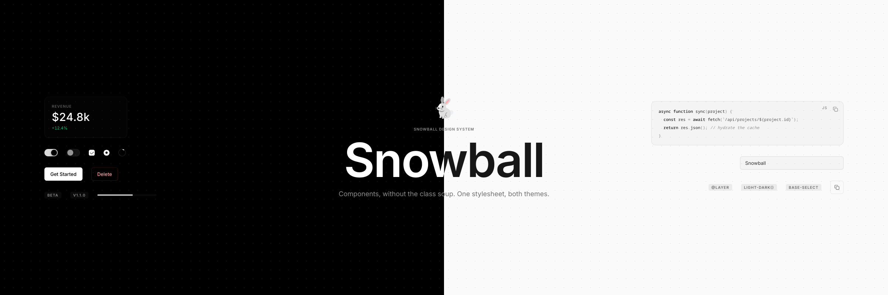

    

# Snowball Design System

A minimalist, modern, dark-first design system — follows the OS color scheme with full light and dark themes, forceable either way.

- **[design.md](design.md)** — principles, tokens, components, and the rules an agent or human should follow. Primarily written to give large language models a complete picture of the system in one read.
- **[snowball.css](snowball.css)** — standalone CSS implementation of the same components, no Tailwind required. Display-only components are semantic tags (`<loadingspinner size="lg">`, `<statcard>`, `<tag>`, `<progressbar>`, `<codeblock lang="ts">`); interactive ones stay real elements styled by attribute (`<button variant="primary">`, `role="switch"` + `aria-checked`, plain `<input>`/`<textarea>`/`<select>`). Follows the OS color scheme by default — force a theme with `data-theme="dark|light"` on `<html>`. Honors `prefers-reduced-motion`, and lives in `@layer snowball` so your own unlayered CSS always wins.
- **[snowball.config.css](snowball.config.css)** — optional theming file loaded after snowball.css; every knob (border width, radii, hairline colors, text steps, fills, accents, fonts, code palette) listed at its default, ready to uncomment. Per-element tweaks: `style="--radius: 4px; --border: 2px"` works on any surface.

#### Preview
open `preview.html` (Tailwind) or `components.html` (snowball.css) in any modern browser.